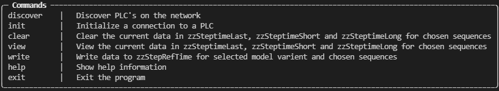
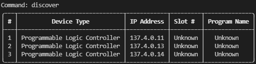
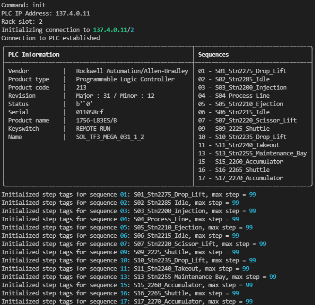
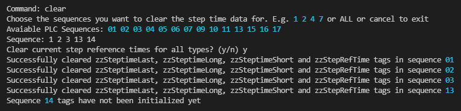
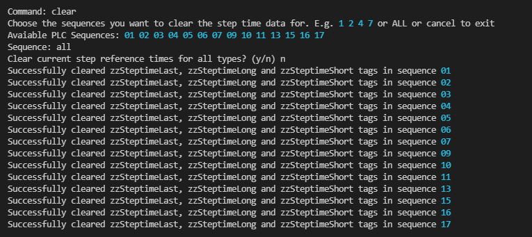
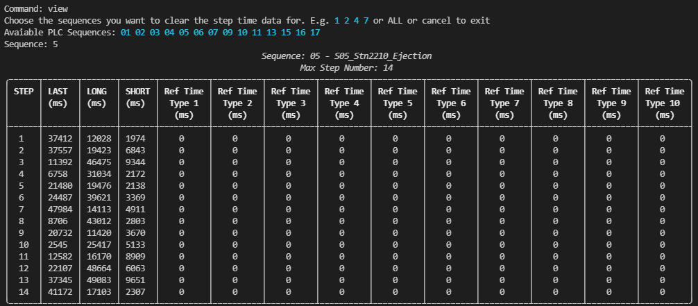
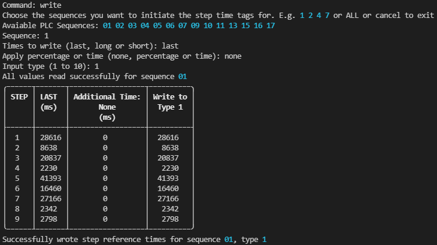
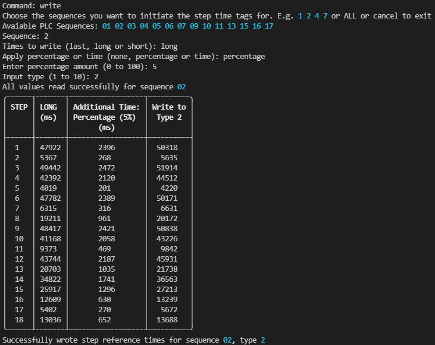
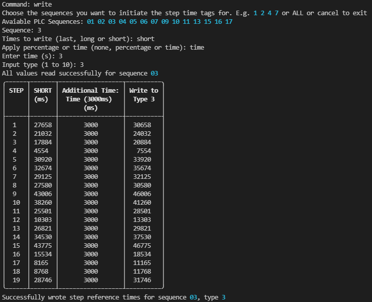

# Step Time Distributor
## Introduction
This tool allows the user to easily read and write the step reference times to the PLC for DCP based projects on Rockwell PLC's.

## Installation
TODO

## Commands
There is a selection of commands to execute different fuctions. These commands should be displayed on startup. Although, if your memory need refreshing then type **help**.

    

### Discover
The **discover** command will scan the netowrk for devices. If any PLC's are found they are returned to the user. The backplane slot position of the PLC cannot be discovered.

    

### Init 
The **init** command will initialize a connection to the PLC the user enters. The user will be prompted to enter the IP address (e.g. 137.4.0.11) and slot number (e.g. 2). Upon a successful connection, information retrived from the PLC will be displayed. The command will create the variables that are used to read and write to the PLC tags. The user has two input methods when deciding which sequences they want to create the variables for.This variable creation will only create enough tags to match the maximum step number for there respective sequences.

    

### Clear
The **clear** commmand allows the user to select the sequences where they want to clear the current data. As standard the PLC tags that are cleared are zzSteptimeLast, zzSteptimeShort and zzSteptimeLong. However, there is a prompt that allows the user to also clear zzStepRefTime tags. The tags are only cleard up to the maximum step number. Like **init tags** the user has two inputs methods for choosing the sequences where the data should be cleared.

1. Specify the sequence numbers. e.g. 1 4 6 7 10
2. Use **all** to create tags for all sequences

    

Or

    

### View
The **view** command will display the current data in the PLC for variables zzSteptimeLast, zzSteptimeShort, zzSteptimeLong and zzStepRefTime, for the sequence the user specifies. Data will only be displayed up the the maximum step number for the respective sequence. Like **init tags** and **clear** the user has two inputs methods for choosing the sequences where the data should be cleared.

1. Specify the sequence numbers. e.g. 1 4 6 7 10
2. Use **all** to create tags for all sequences

    

### Write
The **write** command allows the user to copy data from either zzSteptimeLast, zzSteptimeShort or zzSteptimeLong to zzStepRefTime for the sequences the user specifies. Like **init tags**, **clear** and **view** the users has two methods of specifiying the sequence to be written to.

1. Specify the sequence numbers. e.g. 1 4 6 7 10
2. Use **all** to create tags for all sequences

The user will be prompted to choose what data should be wrote, **last**, **long** or **short**. They'll then be asked if they want to add a percentage or a fixed time to all the data as a buffer. Lastly they'll be asked to choose the types within zzStepRefTime that should be wrote to.

    

Or

    

Or

    

### Contributing
Pull requests are welcome. For major changes, please open an issue first to discuss what you would like to change.

If you encounter problems when using the tool, please raise an issue [here](https://github.com/slowMelon01/stepTimeDistributor/issues), along with the log file, which you'll find in the folder ...

## License
Currently no licence.